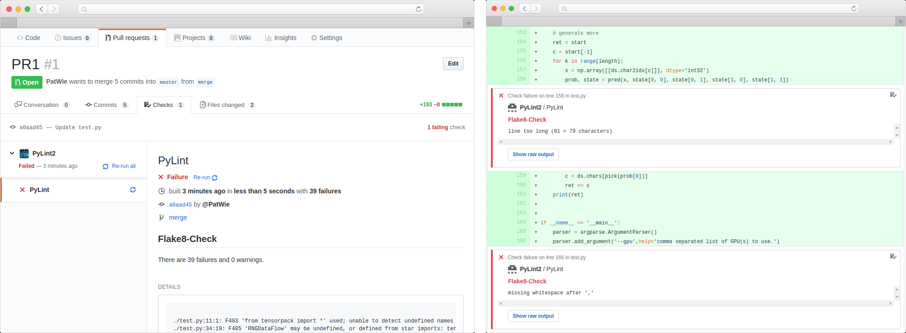

PyLint is a self-hosted *lightweight* GitHub Integration to lint python code in your git repositories. It supports the new GitHub Checks API.

 

  

Features:

* self-hosted and lightweight (just download the release containing 2 binaries)
* out-of-the-box running when properly configured
* it uses the new GitHub Checks-API
* minimal GitHub-permissions are required compared to OAuth and other CI services

Documentation:

* Install Documentation [./INSTALL.md](./INSTALL.md)
